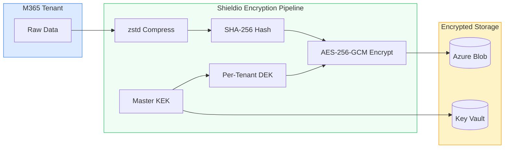
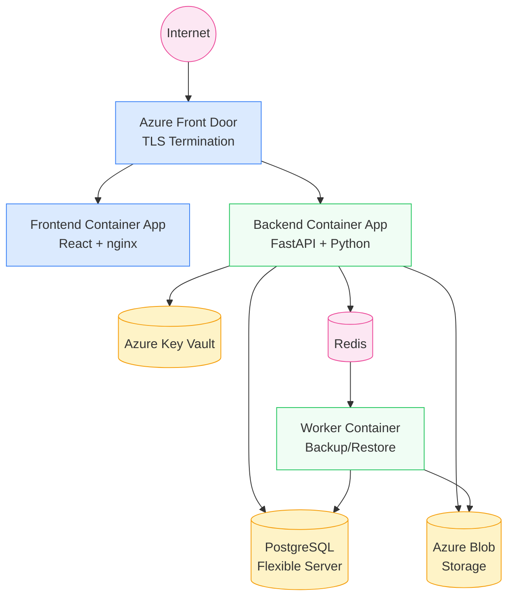

# Shieldio Security Architecture

**Version:** 2.0 | **Last Updated:** March 2026 | **Classification:** Public

---

## Executive Summary

Shieldio is a SaaS data protection platform that backs up and restores Microsoft 365 workloads (Exchange, OneDrive, SharePoint, Teams, Entra ID). Security is foundational to our architecture — we protect our customers' most sensitive business data.

This document describes the security controls, encryption architecture, access controls, and operational security practices implemented in Shieldio.

---

## 1. Encryption



### 1.1 Encryption at Rest

| Layer | Algorithm | Key Management |
|-------|-----------|---------------|
| **Backup data** | AES-256-GCM | Per-tenant Data Encryption Key (DEK) |
| **DEK wrapping** | AES-256-GCM | Master Key Encryption Key (KEK) |
| **KEK storage** | Azure Key Vault | HSM-backed (Azure-managed) |
| **Database** | Azure Transparent Data Encryption | Azure-managed |
| **Blob storage** | Azure Storage Service Encryption | Azure-managed |

**Per-Tenant Key Isolation:**
- Every tenant gets a unique DEK generated at onboarding
- DEKs are wrapped (encrypted) by the master KEK before storage
- DEKs are never stored in plaintext — always wrapped
- Tenant A's DEK cannot decrypt Tenant B's data
- Key rotation: supported via re-wrapping DEKs with new KEK

### 1.2 Encryption in Transit

| Connection | Protocol | Minimum Version |
|-----------|----------|----------------|
| Client → API | TLS | 1.2 |
| API → Microsoft Graph | TLS | 1.2 |
| API → PostgreSQL | TLS | 1.2 |
| API → Azure Blob Storage | TLS | 1.2 |
| API → Azure Key Vault | TLS | 1.2 |

HTTPS is enforced in production via middleware (`FORCE_HTTPS=true`). HTTP requests are redirected to HTTPS with 301.

### 1.3 Content Integrity

- **SHA-256 content hashing** on every backed-up item
- Content hash stored in `snapshot_items.content_hash`
- Used for:
  - Deduplication (content-addressable storage)
  - Backup validation (verify data integrity post-storage)
  - Snapshot comparison (detect changes between backups)
  - Restore verification (confirm restored data matches backup)

---

## 2. Authentication & Authorization

### 2.1 Authentication Methods

| Method | Implementation | Use Case |
|--------|---------------|----------|
| **Password + JWT** | bcrypt hash, HS256 JWT tokens | Local admin accounts |
| **SSO / OIDC** | Microsoft MSAL, Entra ID integration | Enterprise SSO |
| **MFA** | Enforced via Entra ID Conditional Access | Enterprise (SSO) |
| **API tokens** | JWT Bearer tokens | API automation |
| **Refresh tokens** | 7-day rotating refresh tokens | Session management |

### 2.2 Password Policy

| Rule | Default | Configurable |
|------|---------|-------------|
| Minimum length | 8 characters | `PASSWORD_MIN_LENGTH` |
| Uppercase required | Yes | `PASSWORD_REQUIRE_UPPERCASE` |
| Digit required | Yes | `PASSWORD_REQUIRE_DIGIT` |

### 2.3 Authorization (RBAC)

| Role | Permissions |
|------|------------|
| **Admin** | Full access: backup, restore, configure, manage users |
| **Operator** | Backup operations: trigger backups, view jobs, manage policies |
| **Viewer** | Read-only: view dashboard, reports, job status |

Role enforcement via `require_role()` dependency on every API endpoint.

### 2.4 Tenant Isolation

- Every database query includes `tenant_id` filter
- Per-tenant encryption keys prevent cross-tenant data access
- API responses filtered by tenant ownership
- No shared state between tenants

---

## 3. Data Protection

### 3.1 Immutable Storage (WORM)

| Feature | Implementation |
|---------|---------------|
| **Write-Once-Read-Many** | `worm_enabled` flag on SLA policies |
| **Retention locks** | `locked_until` timestamp on snapshots |
| **Legal hold** | `legal_hold` flag prevents deletion regardless of retention |
| **Enforcement** | `StorageService.can_delete_snapshot()` checks before any deletion |
| **Auto-lock** | WORM lock applied automatically when backup completes |

### 3.2 Sensitive Data Discovery

- Regex-based scanner for PII/PHI/PCI patterns
- Runs post-backup on item metadata
- Detects: SSN, credit cards, email addresses, phone numbers, PHI keywords
- Zero cost (pure Python pattern matching)
- Results accessible via `/api/sensitive-data/results`

### 3.3 Malware Scanning

- YARA rule-based scanning before restore operations
- Blocks restore of suspicious content
- Scan status recorded on restore jobs (`scan_status: clean|blocked|skipped`)
- Prevents ransomware reinfection from backup data

### 3.4 Backup Validation

- Automated checksum verification of stored backup data
- Sample-based validation (configurable percentage)
- Verifies blob existence + content hash integrity
- Results: `validation_status` on snapshots
- API: `POST /api/validation/snapshot/{id}`

---

## 4. Infrastructure Security

### 4.1 Deployment Architecture



```
Internet → Azure Front Door (TLS termination)
         → Azure Container Apps (backend API)
         → Azure Container Apps (frontend)
         → Azure PostgreSQL Flexible Server
         → Azure Blob Storage
         → Azure Key Vault
```

### 4.2 Network Security

| Control | Implementation |
|---------|---------------|
| **TLS termination** | Azure Container Apps ingress |
| **CORS** | Configurable origins (`CORS_ORIGINS` env var) |
| **Rate limiting** | 120 requests/minute per IP (configurable) |
| **DDoS protection** | Azure platform-level DDoS protection |
| **Firewall** | PostgreSQL firewall rules (IP allowlist) |

### 4.3 Secrets Management

| Secret | Storage | Access |
|--------|---------|--------|
| Database credentials | Azure Key Vault | Container App env vars |
| Encryption master key | Azure Key Vault | Runtime decryption |
| JWT signing key | Environment variable | Application memory |
| Tenant client secrets | PostgreSQL (AES-256 encrypted) | Application decryption |
| Graph API tokens | MSAL token cache | Application memory (short-lived) |

### 4.4 Container Security

- Base images: Official Python 3.12 slim, nginx Alpine
- No root process execution
- Read-only filesystem (except temp/data volumes)
- Platform: `linux/amd64` for Azure Container Apps
- Docker images scanned for vulnerabilities pre-deploy

---

## 5. API Security

### 5.1 Input Validation

- Pydantic models validate all request bodies
- Query parameter validation via FastAPI `Query()` with type constraints
- SQL injection prevention via SQLAlchemy ORM (parameterized queries)
- Path traversal prevention in storage paths

### 5.2 Output Security

- Global exception handler prevents stack trace leaks
- Error responses include correlation ID (not internal details)
- Sensitive fields stripped from API responses (e.g., password hashes)
- Client secret values never returned in API responses

### 5.3 Request Security

| Header | Purpose |
|--------|---------|
| `X-Correlation-ID` | Request tracing (auto-generated or passed through) |
| `X-Response-Time` | Performance monitoring |
| `Authorization: Bearer` | JWT authentication |
| `Retry-After` | Rate limit backoff guidance |

### 5.4 Security Headers (Production)

| Header | Value | Purpose |
|--------|-------|---------|
| `Strict-Transport-Security` | `max-age=31536000` | HTTPS enforcement |
| `X-Content-Type-Options` | `nosniff` | MIME type sniffing prevention |
| `X-Frame-Options` | `DENY` | Clickjacking prevention |
| `Content-Security-Policy` | Restrictive policy | XSS prevention |

---

## 6. Operational Security

### 6.1 Monitoring & Alerting

| Capability | Implementation |
|-----------|---------------|
| **Structured logging** | JSON format with correlation IDs |
| **Health checks** | `/health` endpoint with DB + storage verification |
| **Anomaly detection** | Smart Engine with z-score baseline deviation |
| **Backup failure alerts** | Email + webhook notifications |
| **Audit logging** | All admin actions logged with user ID, IP, timestamp |

### 6.2 Incident Response

| Detection | Automated Response |
|-----------|-------------------|
| Backup failure | Auto-retry with exponential backoff (5/15/45 min) |
| Graph API throttling | Circuit breaker (pause tenant after >50% failure rate) |
| Anomalous data changes | Smart Engine alert + investigation flag |
| Stale backup jobs | Automatic re-queue after 60-minute timeout |
| Storage failure | Partial job status + retry on next cycle |

### 6.3 Audit Trail

Every administrative action is logged:
- Who (user ID, username)
- What (action type, resource affected)
- When (timestamp)
- Where (IP address)
- Result (success/failure)

Audit logs are immutable (append-only) and available via `/api/audit/logs`.

---

## 7. Compliance Readiness

### 7.1 Data Residency

- Backup data stored in customer-selected Azure region
- Current deployment: Central US
- Multi-region support planned (EU, APAC)

### 7.2 Data Retention

- Configurable per SLA policy (1-365+ days)
- WORM locks prevent premature deletion
- Legal hold overrides retention policies
- Expired data automatically cleaned up by scheduler

### 7.3 Right to Erasure (GDPR Article 17)

- Tenant purge feature deletes all backup data
- Cascade deletion: snapshots → items → storage blobs → dedup entries
- Audit log records deletion for compliance evidence

### 7.4 Framework Mapping

| Framework | Key Articles | Our Controls |
|-----------|-------------|-------------|
| **SOC 2** | CC6.1-CC6.8 | Encryption, RBAC, audit logging, monitoring |
| **GDPR** | Art. 32, 17, 25 | Encryption, erasure, privacy by design |
| **HIPAA** | §164.312 | Access controls, audit, encryption, integrity |

See `docs/COMPLIANCE_MAPPING.md` for detailed control mapping.

---

## 8. Security Testing

### 8.1 Automated Security Checks

Run via `make security-scan`:

| Check | Tool | What It Tests |
|-------|------|--------------|
| Python static analysis | bandit | Common security issues (SQL injection, hardcoded passwords, exec calls) |
| Python dependency vulnerabilities | pip-audit | Known CVEs in Python packages |
| JavaScript dependency vulnerabilities | npm audit | Known CVEs in npm packages |
| Secret detection | grep patterns | Hardcoded API keys, passwords, tokens |
| OWASP Top 10 | Manual checklist | Injection, broken auth, XSS, etc. |

### 8.2 Security Test Results

Generated by `scripts/security-audit.sh` as `security-audit-report.json`.

### 8.3 Penetration Testing

- Recommended before first enterprise customer
- Third-party pen test covers: API fuzzing, authentication bypass, privilege escalation, injection attacks
- Results and remediation tracked in security issue tracker

---

## 9. Responsible Disclosure

If you discover a security vulnerability in Shieldio, please report it responsibly:

- **Email:** security@protectiq.io (update when domain is active)
- **Response time:** We acknowledge within 24 hours
- **Fix timeline:** Critical vulnerabilities patched within 72 hours

We do not take legal action against researchers who follow responsible disclosure practices.

---

## 10. Version History

| Version | Date | Changes |
|---------|------|---------|
| 2.0 | March 2026 | Initial public release |
